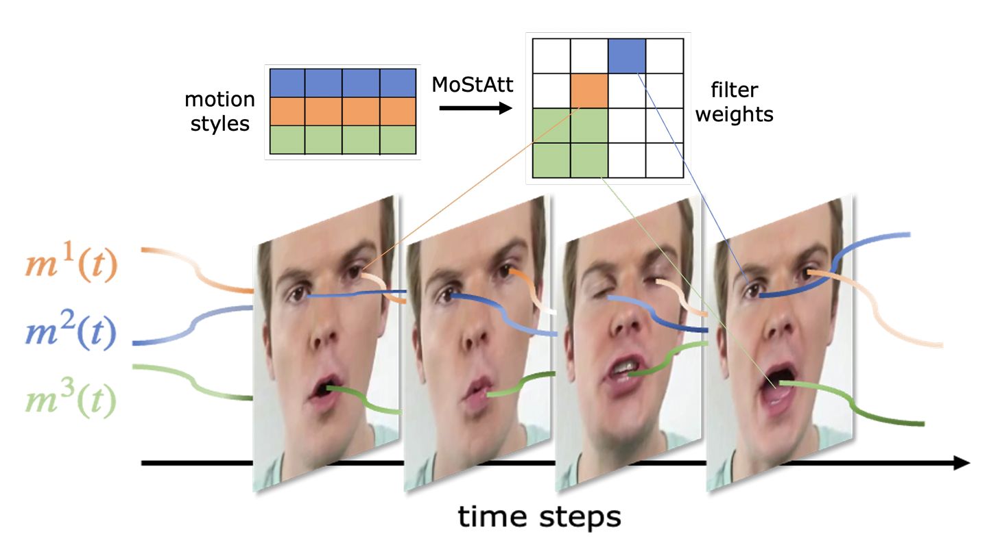
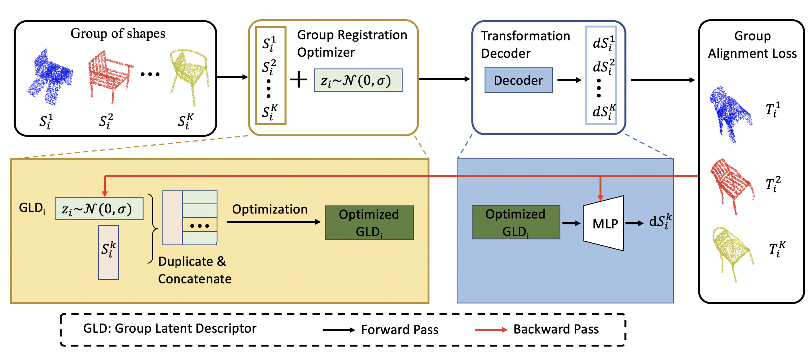
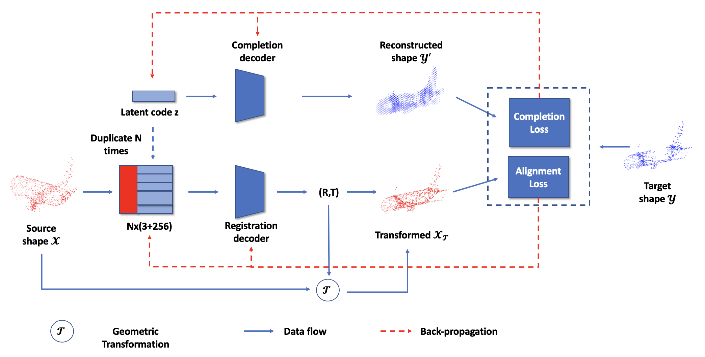

<!-- 

   

 -->

I joined KAUST as Postdoc Associate in Dec 2022. Before that, I was a Postdoc Associate at MMVC Lab, NYU Tandon, and NYU Abu Dhabi since 2019. I received my Bachelor’s degree in remote sensing science and technology from Wuhan University in 2014 and my Ph.D. degree in Cartography and GIS from the Institute of Remote Sensing and Digital Earth, Chinese Academy of Sciences in 2019. 

# Research
My research interests lie in computer vision and remote sensing.

Education
======
* B.S., Wuhan University, 2010-2014.
* Ph.D., Institute of Remote Sensing and Digital Earth, Chinese Academy of Sciences, 2014-2019.

Work experience
======
* 2022 -- present: Postdoc Associate, KAUST
* 2019 -- 2022: Postdoc Associate, New York University, Abu Dhabi

Activities
======
* Journal Review: 
  * ISPRS JPRS, TGRS, GRSL, JSTAR, IJGI, JARS, Sensors, AIRQ.
  * TIP, TVCG, TEVC, TBD, NeuroComputing, PRL, Comput. Intell. Neurosci., IEEE ACCESS.
* Conference Review: BMVC 2020, ICCV 2021, IROS 2021, BMVC 2021, AAAI 2022, WACV 2022, CVPR 2022, ECCV 2022, ACCV 2022, BMVC 2022, WACV 2023, AAAI 2023, CVPR 2023, NuerIPS 2023.
* Guest Editor of the special issue [["3D Computer Vision]](https://www.frontiersin.org/research-topics/23013/3d-computer-vision#overview)" of the journal "Frontiers in Computer Science".

Honors and Awards
======
* Outstanding Reviewer for ICCV 2021.
* Postdoc Non-travel Award, NYUAD 2021.
* Postdoc Non-travel Award, NYUAD 2020.
* National Scholarship, University of Chinese Academy of Sciences, 2018
* Excellent research paper award, Institute of Remote Sensing and Digital Earth, CAS, 2018
* China Scholarship Council scholarship, 2017
* Presidential Foundation of RADI, 2017
* Seagate Scholarship, Wuhan University, 2012
* National Scholarship, Wuhan University, 2011

<!-- 
 -->

<h2>Selected Publications</h2>
[# denotes equal contribution, * denotes corresponding author]

<table cellspacing="0" cellpadding="0">

<tr>
<td style="padding:0px;width:30%;vertical-align:middle">
  
</td>
<td style="padding:20px;width:70%;vertical-align:middle">  
  <h3>MiniGPT-4: Enhancing Vision-Language Understanding with Advanced Large Language Models.</h3>
  Deyao Zhu, Jun Chen, Xiaoqian Shen, <b>Xiang Li</b>, Mohamed Elhoseiny.
   
  <em>arxiv</em>, 2023
   
  

    <a href="https://minigpt-4.github.io/">[project]</a>
    <a href="https://arxiv.org/abs/2304.10592">[paper]</a>
    <a href="https://github.com/Vision-CAIR/MiniGPT-4">[code]</a>
    <a href="https://huggingface.co/spaces/Vision-CAIR/minigpt4">[huggingface demo]</a>
  
  
</td>
</tr>  

<tr>
<td style="padding:0px;width:30%;vertical-align:middle">
  
</td>
<td style="padding:20px;width:70%;vertical-align:middle">  
  <h3>Vision-Language Models in Remote Sensing: Current Progress and Future Trends.
  </h3>
  Congcong Wen, Yuan Hu, <b>Xiang Li*</b>, Zhengpeng Yuan, Xiao Xiang Zhu.
   
  <em>International Journal of Applied Earth Observation and Geoinformation (JAG)</em>, 2023
   
  

    <!-- <a href="https://minigpt-4.github.io/">[project]</a> -->
    <a href="https://arxiv.org/abs/2305.05726">[paper]</a>
    <!-- <a href="https://github.com/Vision-CAIR/MiniGPT-4">[code]</a> -->
    <!-- <a href="https://huggingface.co/spaces/Vision-CAIR/minigpt4">[huggingface demo]</a> -->
  
  
</td>
</tr> 

<tr>
<td style="padding:0px;width:30%;vertical-align:middle">
  
</td>
<td style="padding:20px;width:70%;vertical-align:middle">  
  <h3>MoStGAN-V: Video Generation with Temporal Motion Styles.
  </h3>
  Xiaoqian Shen, <b>Xiang Li</b>, Mohamed Elhoseiny.
   
  <em>CVPR</em>, 2023
   
  

    <a href="https://github.com/xiaoqian-shen/MoStGAN-V/">[project]</a>
    <a href="https://arxiv.org/abs/2304.02777">[paper]</a>
    <a href="https://github.com/xiaoqian-shen/MoStGAN-V">[code]</a>
    <!-- <a href="https://huggingface.co/spaces/Vision-CAIR/minigpt4">[huggingface demo]</a> -->
  
  
</td>
</tr> 

<tr>
<td style="padding:0px;width:30%;vertical-align:middle">
  
</td>
<td style="padding:20px;width:70%;vertical-align:middle">  
  <h3>GP-Aligner: Unsupervised Groupwise Non-Rigid Point Set Registration Based On Optimizable Group Latent Descriptor.
  </h3>
  Lingjing Wang, Nan Zhou, Hao Huang, Jifei Wang, <b>Xiang Li*.
   
  <em>TGRS</em>, 2022
   
  

    <!-- <a href="https://github.com/xiaoqian-shen/MoStGAN-V/">[project]</a> -->
    <a href="https://ieeexplore.ieee.org/document/9994035">[paper]</a>
    <!-- <a href="https://github.com/xiaoqian-shen/MoStGAN-V">[code]</a> -->
    <!-- <a href="https://huggingface.co/spaces/Vision-CAIR/minigpt4">[huggingface demo]</a> -->
  
  
</td>
</tr> 

<tr>
<td style="padding:0px;width:30%;vertical-align:middle">
  
</td>
<td style="padding:20px;width:70%;vertical-align:middle">  
  <h3>Meta-Det3D: Learn to Learn Few-Shot 3D Object Detection.
  </h3>
  Shuaihang Yuan#, <b>Xiang Li#</b>, Hao Huang, Yi Fang.
   
  <em>ACCV</em>, 2022 (oral)
   
  

    <!-- <a href="https://github.com/xiaoqian-shen/MoStGAN-V/">[project]</a> -->
    <a href="https://openaccess.thecvf.com/content/ACCV2022/papers/Yuan_Meta-Det3D_Learn_to_Learn_Few-Shot_3D_Object_Detection_ACCV_2022_paper.pdf">[paper]</a>
    <!-- <a href="https://github.com/xiaoqian-shen/MoStGAN-V">[code]</a> -->
    <!-- <a href="https://huggingface.co/spaces/Vision-CAIR/minigpt4">[huggingface demo]</a> -->
  
  
</td>
</tr> 

<tr>
<td style="padding:0px;width:30%;vertical-align:middle">
  
</td>
<td style="padding:20px;width:70%;vertical-align:middle">  
  <h3>Unsupervised Category-Specific Partial Point Set Registration via Joint Shape Completion and Registration.
  </h3>
  <b>Xiang Li</b>, Lingjing Wang, Yi Fang.
   
  <em>TVCG</em>, 2022
   
  

    <!-- <a href="https://github.com/xiaoqian-shen/MoStGAN-V/">[project]</a> -->
    <a href="https://arxiv.org/abs/2009.05290">[paper]</a>
    <!-- <a href="https://github.com/xiaoqian-shen/MoStGAN-V">[code]</a> -->
    <!-- <a href="https://huggingface.co/spaces/Vision-CAIR/minigpt4">[huggingface demo]</a> -->
  
  
</td>
</tr> 

<tr>
<td style="padding:0px;width:30%;vertical-align:middle">
  
</td>
<td style="padding:20px;width:70%;vertical-align:middle">  
  <h3>Few-shot Object Detection on Remote Sensing Images.
  </h3>
  <b>Xiang Li#</b>, Jingyu Deng#, Yi Fang.
   
  <em>TGRS</em>, 2021
   
  

    <!-- <a href="https://github.com/xiaoqian-shen/MoStGAN-V/">[project]</a> -->
    <a href="https://ieeexplore.ieee.org/document/9362267">[paper]</a>
    <!-- <a href="https://github.com/xiaoqian-shen/MoStGAN-V">[code]</a> -->
    <!-- <a href="https://huggingface.co/spaces/Vision-CAIR/minigpt4">[huggingface demo]</a> -->
  
  
</td>
</tr> 

<tr>
<td style="padding:0px;width:30%;vertical-align:middle">
  
</td>
<td style="padding:20px;width:70%;vertical-align:middle">  
  <h3>Density-Aware Convolutional Networks with Context Encoding for Airborne LiDAR Point Cloud Classification.
  </h3>
  <b>Xiang Li</b>, Lingjing Wang, Mingyang Wang, Congcong Wen, Nan Zhou, Yi Fang.
   
  <em>ISPRS JPRS</em>, 2021
   
  

    <!-- <a href="https://github.com/xiaoqian-shen/MoStGAN-V/">[project]</a> -->
    <a href="https://arxiv.org/abs/1910.05909">[paper]</a>
    <!-- <a href="https://github.com/xiaoqian-shen/MoStGAN-V">[code]</a> -->
    <!-- <a href="https://huggingface.co/spaces/Vision-CAIR/minigpt4">[huggingface demo]</a> -->
  
  
</td>
</tr> 

<tr>
<td style="padding:0px;width:30%;vertical-align:middle">
  
</td>
<td style="padding:20px;width:70%;vertical-align:middle">  
  <h3>Topology Constrained Shape Correspondence.
  </h3>
  <b>Xiang Li#</b>, Congcong Wen#, Lingjing Wang, Yi Fang.
   
  <em>TVCG</em>, 2020
   
  

    <!-- <a href="https://github.com/xiaoqian-shen/MoStGAN-V/">[project]</a> -->
    <a href="https://ieeexplore.ieee.org/document/9091324">[paper]</a>
    <a href="https://github.com/lixiang-ucas/TP-Net">[code]</a>
    <!-- <a href="https://huggingface.co/spaces/Vision-CAIR/minigpt4">[huggingface demo]</a> -->
  
  
</td>
</tr> 

<tr>
<td style="padding:0px;width:30%;vertical-align:middle">
  
</td>
<td style="padding:20px;width:70%;vertical-align:middle">  
  <h3>Few-shot Learning of Part-specific Probability Space for 3D Shape Segmentation.
  </h3>
  Lingjing Wang#, <b>Xiang Li#</b>, Yi Fang.
   
  <em>CVPR</em>, 2020
   
  

    <!-- <a href="https://github.com/xiaoqian-shen/MoStGAN-V/">[project]</a> -->
    <a href="https://paperswithcode.com/paper/few-shot-learning-of-part-specific">[paper]</a>
    <!-- <a href="https://github.com/lixiang-ucas/TP-Net">[code]</a> -->
    <!-- <a href="https://huggingface.co/spaces/Vision-CAIR/minigpt4">[huggingface demo]</a> -->
  
  
</td>
</tr> 

<tr>
<td style="padding:0px;width:30%;vertical-align:middle">
  
</td>
<td style="padding:20px;width:70%;vertical-align:middle">  
  <h3>Directionally Constrained Fully Convolutional Neural Network For Airborne Lidar Point Cloud Classification.
  </h3>
  Congcong Wen, Lina Yang, Ling Peng, <b>Xiang Li*</b>
   
  <em>ISPRS JPRS</em>, 2020
   
  

    <!-- <a href="https://github.com/xiaoqian-shen/MoStGAN-V/">[project]</a> -->
    <a href="https://authors.elsevier.com/a/1abO93I9x1cfvT">[paper]</a>
    <a href="https://https://github.com/lx709/D-FCN">[code]</a>
    <!-- <a href="https://huggingface.co/spaces/Vision-CAIR/minigpt4">[huggingface demo]</a> -->
  
  
</td>
</tr> 

</table>

