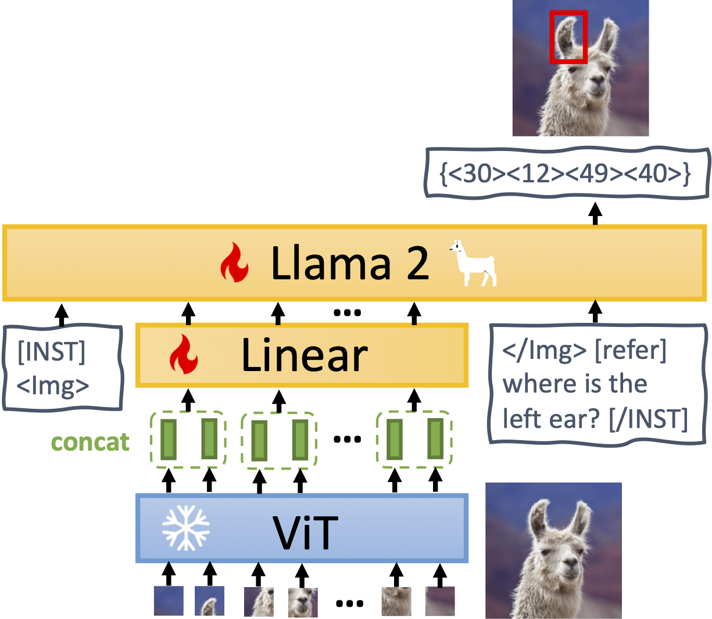
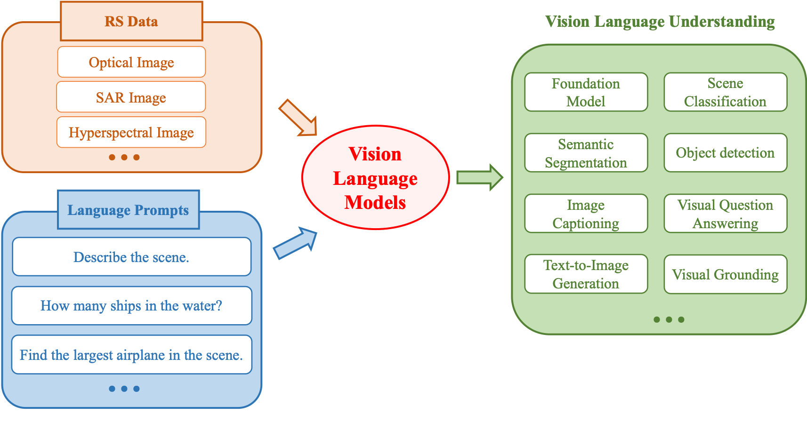
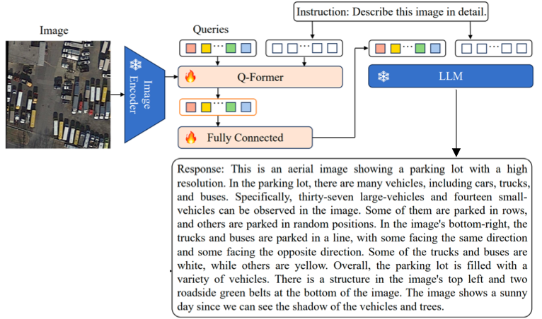
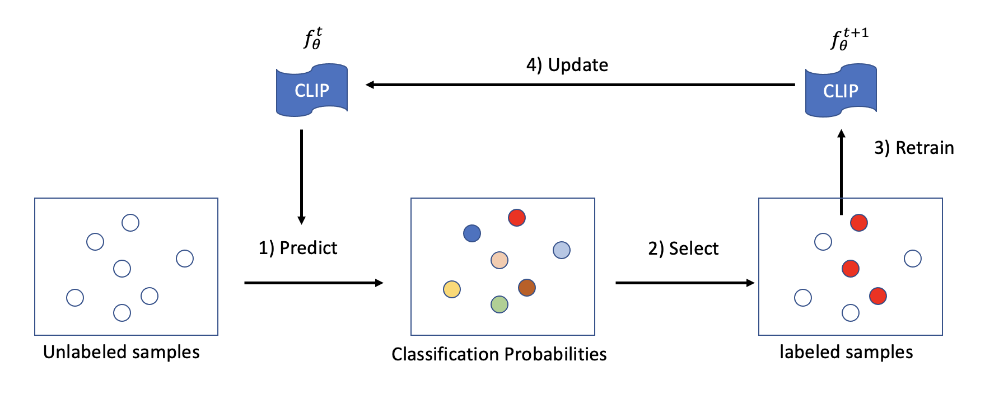
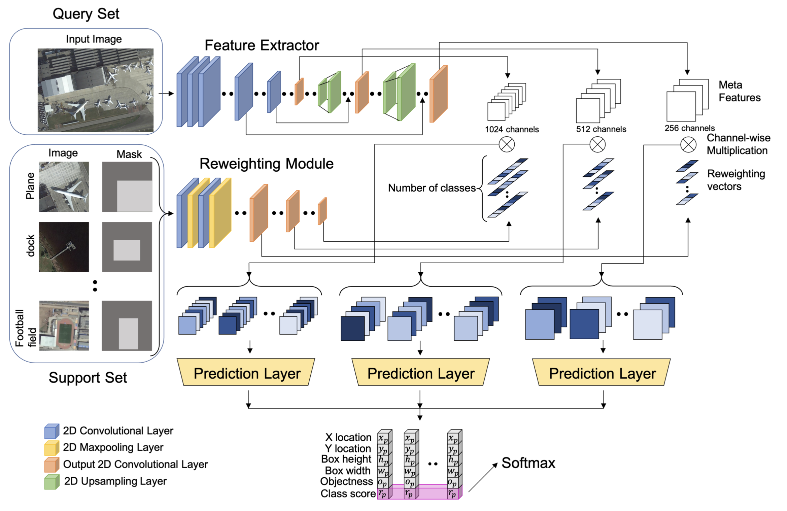
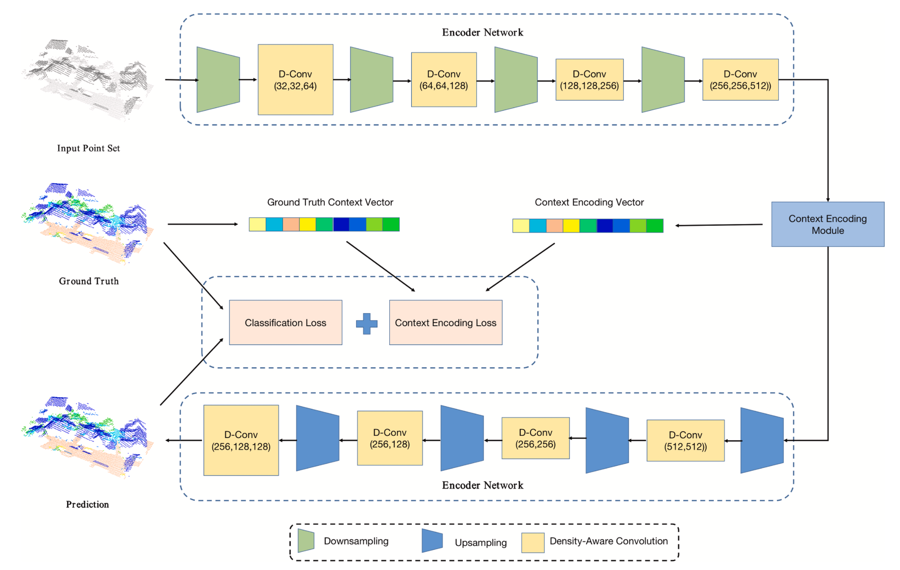
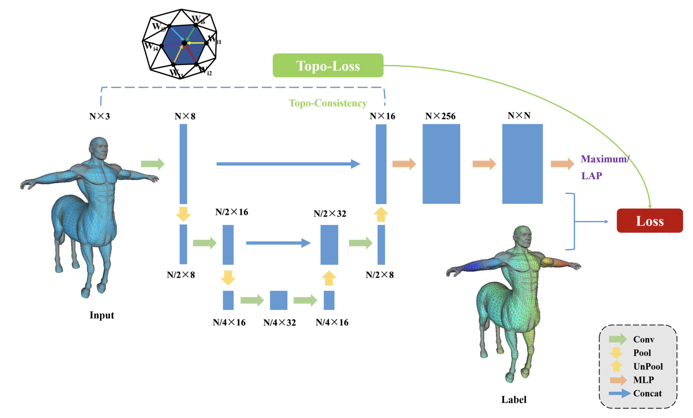
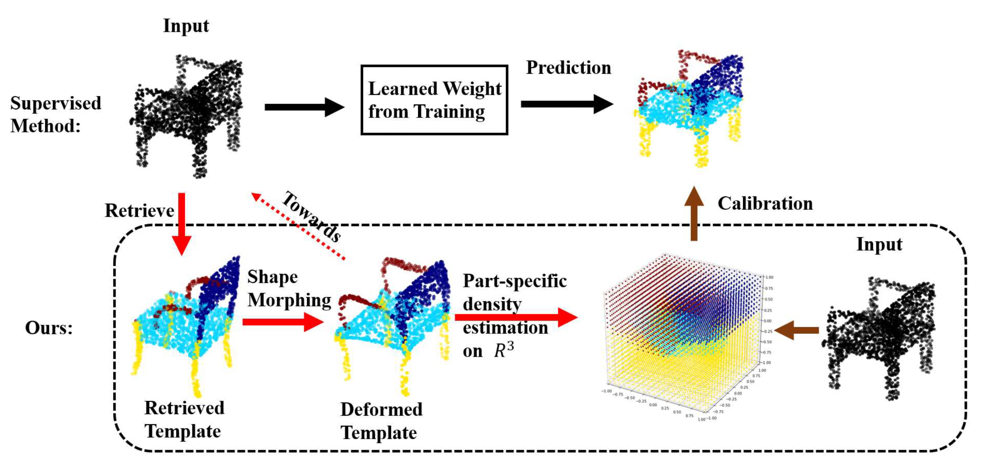
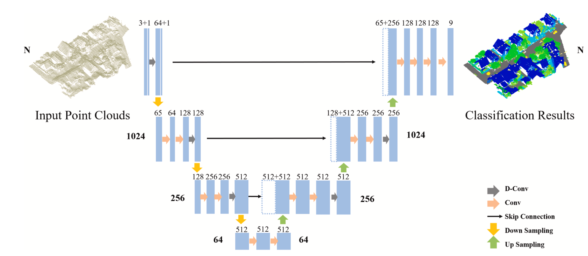

<!-- 

   

 -->

I am a Lecturer (Assistant Professor) in Computer Science at the University of Reading. Prior to this, I was a Postdoctoral Researcher at the VisionCAIR lab at King Abdullah University of Science and Technology (KAUST), working under the supervision of Prof. [Mohamed Elhoseiny](https://www.mohamed-elhoseiny.com/). Before my time at KAUST, I held a Postdoctoral Researcher position at the Multimedia and Visual Computing (MMVC) Lab, where I worked closely with Prof. [Yi Fang](https://engineering.nyu.edu/faculty/yi-fang).

I earned my Ph.D. in 2019 from the Institute of Remote Sensing and Digital Earth (RADI), Chinese Academy of Sciences (CAS), under the supervision of Prof. Tianhe Chi. I also hold a Bachelor’s degree from Wuhan University, which I received in 2014.

My research interests lie at the intersection of multimodal large language models (LLMs), 3D computer vision, and remote sensing.

Academic Service
======
* Journal Review: 
  * TPAMI, TIP, TVCG, TEVC, TBD, CVIU, NeuroComputing, PRL, etc.
  * RSE, ISPRS JPRS, TGRS, GRSM, etc.
* Conference Review: 
  * CVPR (2022/2023/2024/2025), ICCV (2021/2023), ECCV (2022/2024), NeruIPS (2023/2024), ICML(2024), ICLR (2024/2025), AAAI (2022/2023/2024), etc.

<h2>Selected Publications</h2>
[# denotes equal contribution, * denotes corresponding author]
<table cellspacing="0" cellpadding="0">

<tr>
<td style="padding:0px;width:30%;vertical-align:middle">
  
</td>
<td style="padding:20px;width:70%;vertical-align:middle">  
  <h3>MiniGPT-4: Enhancing Vision-Language Understanding with Advanced Large Language Models.</h3>
  Deyao Zhu, Jun Chen, Xiaoqian Shen, <b>Xiang Li</b>, Mohamed Elhoseiny.
   
  <em>arxiv</em>, 2023
   
  

    <a href="https://minigpt-4.github.io/">[project]</a>
    <a href="https://arxiv.org/abs/2304.10592">[paper]</a>
    <a href="https://github.com/Vision-CAIR/MiniGPT-4">[code]</a>
    <a href="https://huggingface.co/spaces/Vision-CAIR/minigpt4">[huggingface demo]</a>
  
  
</td>
</tr>  

<tr>
<td style="padding:0px;width:30%;vertical-align:middle">
  
</td>
<td style="padding:20px;width:70%;vertical-align:middle">  
  <h3>MiniGPT-v2: Large Language Model as a Unified Interface for Vision-Language Multi-task Learning.</h3>
  Jun Chen, Deyao Zhu, Xiaoqian Shen, <b>Xiang Li</b>, Zechun Liu, Pengchuan Zhang, Raghuraman Krishnamoorthi, Vikas Chandra, Yunyang Xiong, Mohamed Elhoseiny.
   
  <em>arxiv</em>, 2023
   
  

    <a href="https://minigpt-v2.github.io/">[project]</a>
    <a href="https://arxiv.org/abs/2310.09478">[paper]</a>
    <a href="https://github.com/Vision-CAIR/MiniGPT-4">[code]</a>
    <a href="https://huggingface.co/spaces/Vision-CAIR/MiniGPT-v2">[huggingface demo]</a>
  
  
</td>
</tr>  

<tr>
<td style="padding:0px;width:30%;vertical-align:middle">
  
</td>
<td style="padding:20px;width:70%;vertical-align:middle">  
  <h3>Vision-Language Models in Remote Sensing: Current Progress and Future Trends.
  </h3>
  <b>Xiang Li*</b>, Congcong Wen, Yuan Hu, Zhengpeng Yuan, Xiao Xiang Zhu.
   
  <em>IEEE Geoscience and Remote Sensing Magazine (GRSM)</em>, 2024
   
  

    <!-- <a href="https://minigpt-4.github.io/">[project]</a> -->
    <a href="https://arxiv.org/abs/2305.05726">[paper]</a>
    <!-- <a href="https://github.com/Vision-CAIR/MiniGPT-4">[code]</a> -->
    <!-- <a href="https://huggingface.co/spaces/Vision-CAIR/minigpt4">[huggingface demo]</a> -->
  
  
</td>
</tr> 

<tr>
<td style="padding:0px;width:30%;vertical-align:middle">
  
</td>
<td style="padding:20px;width:70%;vertical-align:middle">  
  <h3>RSGPT: A Remote Sensing Vision Language Model and Benchmark.</h3>
  Yuan Hu, Jianlong Yuan, Congcong Wen, Xiaonan Lu, <b>Xiang Li*</b>.
   
  <em>arxiv</em>, 2023
   
  

    <a href="https://github.com/Lavender105/RSGPT">[project]</a>
    <a href="https://arxiv.org/abs/2307.15266">[paper]</a>
    <a href="https://github.com/Lavender105/RSGPT">[code]</a>
  
  
</td>
</tr>  

<tr>
<td style="padding:0px;width:30%;vertical-align:middle">
  
</td>
<td style="padding:20px;width:70%;vertical-align:middle">  
  <h3>RS-CLIP: Zero Shot Remote Sensing Scene Classification via Contrastive Vision-Language Supervision.</h3>
  <b>Xiang Li</b>, Xiang Li, Congcong Wen, Nan Zhou.
   
  <em>International Journal of Applied Earth Observation and Geoinformation (JAG)</em>, 2023
   
  

    <a href="https://github.com/lx709/RS-CLIP">[project]</a>
    <a href="https://www.sciencedirect.com/science/article/pii/S1569843223003217">[paper]</a>
    <a href="https://github.com/lx709/RS-CLIP">[code]</a>
  
  
</td>
</tr>  

<tr>
<td style="padding:0px;width:30%;vertical-align:middle">
  
</td>
<td style="padding:20px;width:70%;vertical-align:middle">  
  <h3>Few-shot Object Detection on Remote Sensing Images.
  </h3>
  <b>Xiang Li#</b>, Jingyu Deng#, Yi Fang.
   
  <em>TGRS</em>, 2021
   
  

    <!-- <a href="https://github.com/xiaoqian-shen/MoStGAN-V/">[project]</a> -->
    <a href="https://ieeexplore.ieee.org/document/9362267">[paper]</a>
    <a href="https://github.com/lixiang-ucas/FSODM">[code]</a>
    <!-- <a href="https://huggingface.co/spaces/Vision-CAIR/minigpt4">[huggingface demo]</a> -->
  
  
</td>
</tr> 

<tr>
<td style="padding:0px;width:30%;vertical-align:middle">
  
</td>
<td style="padding:20px;width:70%;vertical-align:middle">  
  <h3>Density-Aware Convolutional Networks with Context Encoding for Airborne LiDAR Point Cloud Classification.
  </h3>
  <b>Xiang Li</b>, Lingjing Wang, Mingyang Wang, Congcong Wen, Nan Zhou, Yi Fang.
   
  <em>ISPRS JPRS</em>, 2021
   
  

    <!-- <a href="https://github.com/xiaoqian-shen/MoStGAN-V/">[project]</a> -->
    <a href="https://arxiv.org/abs/1910.05909">[paper]</a>
    <!-- <a href="https://github.com/xiaoqian-shen/MoStGAN-V">[code]</a> -->
    <!-- <a href="https://huggingface.co/spaces/Vision-CAIR/minigpt4">[huggingface demo]</a> -->
  
  
</td>
</tr> 

<tr>
<td style="padding:0px;width:30%;vertical-align:middle">
  
</td>
<td style="padding:20px;width:70%;vertical-align:middle">  
  <h3>Topology Constrained Shape Correspondence.
  </h3>
  <b>Xiang Li#</b>, Congcong Wen#, Lingjing Wang, Yi Fang.
   
  <em>TVCG</em>, 2020
   
  

    <!-- <a href="https://github.com/xiaoqian-shen/MoStGAN-V/">[project]</a> -->
    <a href="https://ieeexplore.ieee.org/document/9091324">[paper]</a>
    <a href="https://github.com/lixiang-ucas/TP-Net">[code]</a>
    <!-- <a href="https://huggingface.co/spaces/Vision-CAIR/minigpt4">[huggingface demo]</a> -->
  
  
</td>
</tr> 

<tr>
<td style="padding:0px;width:30%;vertical-align:middle">
  
</td>
<td style="padding:20px;width:70%;vertical-align:middle">  
  <h3>Few-shot Learning of Part-specific Probability Space for 3D Shape Segmentation.
  </h3>
  Lingjing Wang#, <b>Xiang Li#</b>, Yi Fang.
   
  <em>CVPR</em>, 2020
   
  

    <!-- <a href="https://github.com/xiaoqian-shen/MoStGAN-V/">[project]</a> -->
    <a href="https://paperswithcode.com/paper/few-shot-learning-of-part-specific">[paper]</a>
    <a href="https://github.com/Lingjing324/Few-Shot-Learning-of-Part-Specific-Probability-Space-for-3D-Shape-Segmentation">[code]</a>
    <!-- <a href="https://huggingface.co/spaces/Vision-CAIR/minigpt4">[huggingface demo]</a> -->
  
  
</td>
</tr> 

<tr>
<td style="padding:0px;width:30%;vertical-align:middle">
  
</td>
<td style="padding:20px;width:70%;vertical-align:middle">  
  <h3>Directionally Constrained Fully Convolutional Neural Network For Airborne Lidar Point Cloud Classification.
  </h3>
  Congcong Wen, Lina Yang, Ling Peng, <b>Xiang Li*</b>
   
  <em>ISPRS JPRS</em>, 2020
   
  

    <!-- <a href="https://github.com/xiaoqian-shen/MoStGAN-V/">[project]</a> -->
    <a href="https://authors.elsevier.com/a/1abO93I9x1cfvT">[paper]</a>
    <a href="https://https://github.com/lx709/D-FCN">[code]</a>
    <!-- <a href="https://huggingface.co/spaces/Vision-CAIR/minigpt4">[huggingface demo]</a> -->
  
  
</td>
</tr> 

</table>

Honors and Awards
======
* Outstanding Reviewer for ICCV 2021.
* Postdoc Non-travel Award, NYUAD 2020 & 2021.
* National Scholarship, University of Chinese Academy of Sciences, 2018
* China Scholarship Council (CSC) scholarship, 2017
* Director's Fund of RADI, 2017
* Seagate Scholarship, Wuhan University, 2012
* National Scholarship, Wuhan University, 2011

