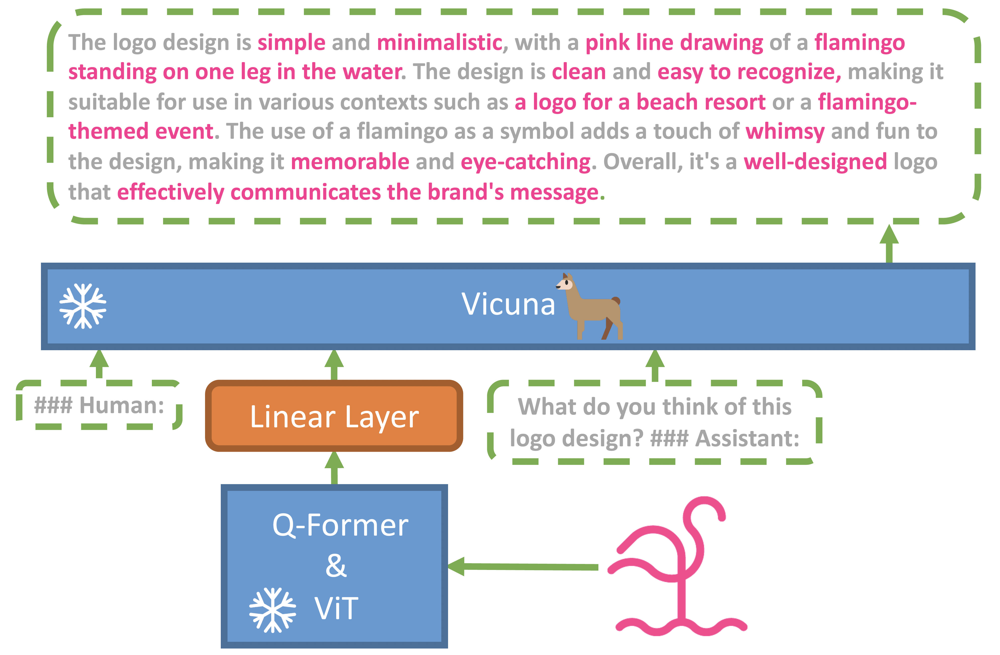
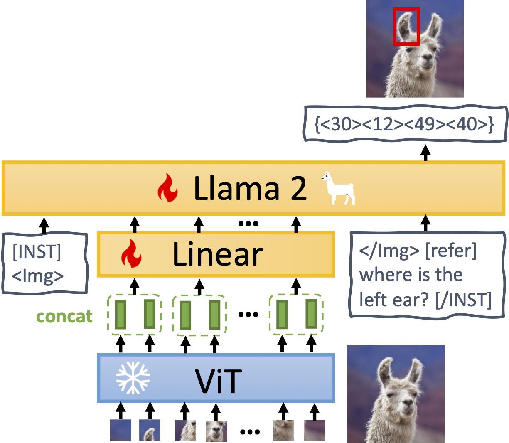
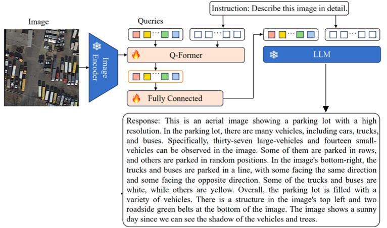
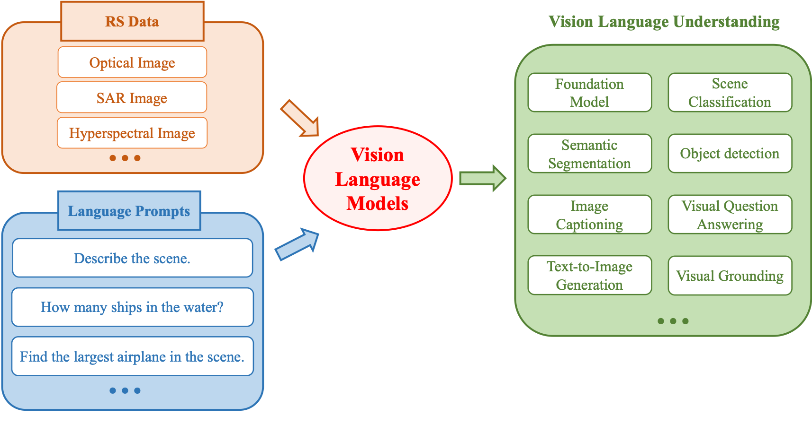
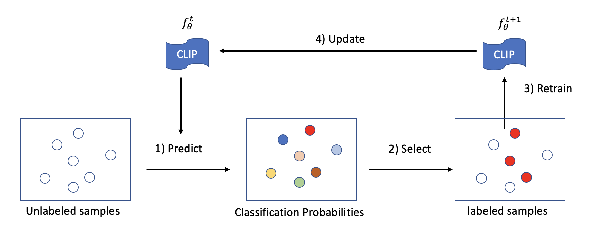
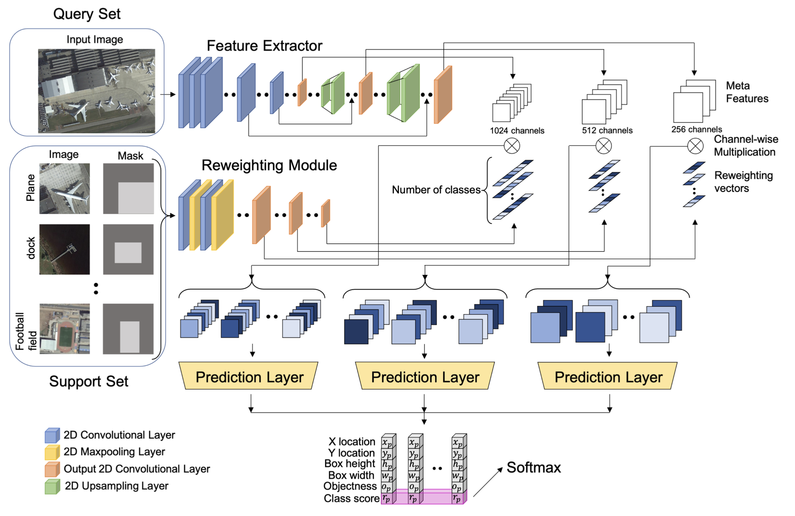
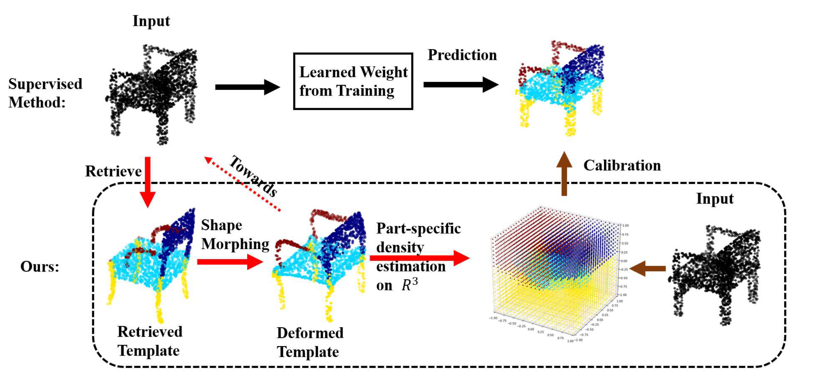
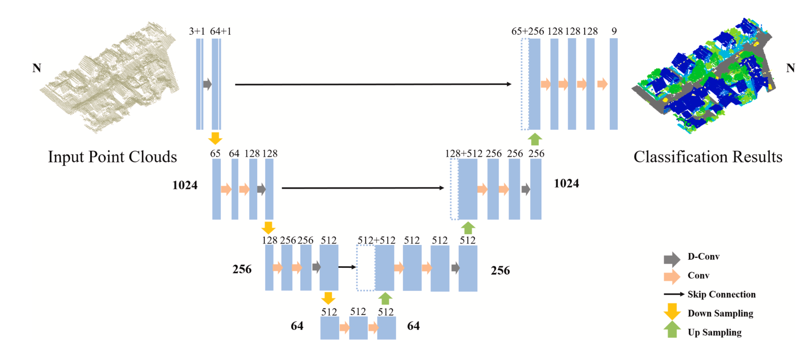

I am a Lecturer (Assistant Professor) in the School of Computer Science at the University of Bristol and a faculty member of the Machine Learning and Computer Vision (MaVi) group, working with Prof. [Dima Damen](https://www.bristol.ac.uk/people/person/Dima-Damen-d7924e62-0857-40fb-b9e4-9be99d801b7f/). Prior to joining Bristol, I held a Lecturer position at the University of Reading. Before that, I was a Postdoctoral Researcher at KAUST, working with Prof. [Mohamed Elhoseiny](https://scholar.google.com/citations?user=iRBUTOAAAAAJ&hl=en), and at NYU, working with Prof. [Yi Fang](https://scholar.google.com/citations?hl=en&user=j-cyhzwAAAAJ). My research focuses on multimodal large language models, computer vision, and remote sensing. I have published over 50 papers in top conferences and journals in computer vision and remote sensing, such as CVPR, ICCV, NeurIPS, TVCG, and TGRS, with  citations on Google Scholar and an h-index of 28. I contributed to the well-known <a href="https://github.com/Vision-CAIR/MiniGPT-4">MiniGPT-4</a> project, with over 3000 citations on Google Scholar. I served as a Guest Editor for several prestigious journals, including IEEE GRSM, IEEE JSTARS, and GSIS, and will serve as an Area Chair for ICLR 2026. I received the IEEE GRSS Early Career Award 2025 for high-impact research in computer vision methods in remote sensing applications.

🔥Hiring PhD students and interns: Welcome enthusiastic students passionate about multimodal LLMs, 3D vision, and remote sensing to apply for PhD positions and internships.

🔥 News

<ul>
<li>[10/2025] We released <a href="https://geo-r1.github.io/"><strong>Geo-R1</strong></a>, a reasoning-centric MLLM for aerial imagery.</li>
<li>[09/2025] <a href="https://github.com/lx709/REOBench"><strong>REOBench</strong></a> was accepted for publication at NeurIPS 2025 Datasets & Benchmarks Track.</li>
<li>[09/2025] I will serve as an Area Chair of ICLR 2026.</li>
<li>[09/2025] I joined the University of Bristol as a Lecturer in Computer Vision.</li>
<li>[08/2025] I received the <strong><a href="https://www.grss-ieee.org/about/history/grss-past-awards/">IEEE GRSS Early Career Award</a></strong> 2025.</li>
<li>[08/2025] <a href="https://arxiv.org/abs/2310.18511">3DCoMPaT++</a> was accepted for publication at <strong>IEEE TPAMI</strong>.</li>
<li>[07/2025] I am honored to serve as the Guest Editor for the Special Issue titled "Advancing Geospatial Image Perception and Understanding Under Challenging Real-World Conditions" in the journal Geo-spatial Information Science (<strong>GSIS</strong>).</li>
<li>[07/2025] One paper on visual grounding <a href="https://github.com/VisionXLab/GeoGround">GeoGound</a> was accepted for publication at <strong>ICCV 2025 SEA workshop</strong>.</li>
<li>[06/2025] One paper on few-shot oriented object detection (<a href="https://ieeexplore.ieee.org/document/11030667/">FOMC</a>) was accepted by <strong>IEEE TGRS</strong>.</li>
<li>[06/2025] I joined ELLIS, a pan-European AI network of excellence.</li>
<li>[05/2025] We released <a href="https://github.com/lx709/REOBench"><strong>REOBench</strong></a>: A benchmark for evaluating the robustness of Earth observation foundation models.</li>
<li>[05/2025] I gave a seminar talk on "Large Vision Language Models in Remote Sensing: Datasets and Models" at the <strong>Data Assimilation Research Center</strong>.</li>
<li>[04/2025] Stable-SPAM was accepted for publication at <strong>ICLR 2025 Workshop SCOPE</strong>.</li>
<li>[03/2025] <a href="https://github.com/Lavender105/RSGPT"><strong>RSGPT</strong></a> was accepted for publication at <strong>ISPRS JPRS</strong>. RSGPT is the first attempt at GPT-based MLLMs in remote sensing.</li>
<li>[03/2025] <a href="https://arxiv.org/abs/2502.17055"><strong>Stable-SPAM</strong></a> was accepted for publication at <strong>COLM</strong>.</li>
<li>[12/2024] Opening position: One fully funded PhD position in AI for Bioversity (closed).</li>
<li>[10/2024] I joined the University of Reading as a Lecturer in Computer Science.</li>
<li>[09/2024] Two papers accepted at NeruIPS 2024 Datasets and Benchmarks Track <a href="https://github.com/lx709/VRSBench">VRSBench</a> and <a href="https://github.com/3DCoMPaT200/3DCoMPaT200">3DCoMPaT200</a>.</li>
<li>[07/2024] One paper on 3D LLM (<strong>Uni3DL</strong>) was accepted by <strong>ECCV 2024</strong>.</li>
<li>[07/2024] I will serve as the Guest Editor for the special issue "<a href="https://www.grss-ieee.org/wp-content/uploads/2024/10/call-for-papers_GRSM_SI_VLM.pdf">Vision-Language Models in Remote Sensing</a>" at <strong>IEEE GRSM</strong>.</li>
<li>[06/2024] I'm co-organizing the <a href="https://3dcompat-dataset.org/workshop/C3DV24/">C3DV 2024</a>: 2nd Workshop on Compositional 3D Vision at CVPR 2024.</li>
<li>[05/2024] One paper on few-shot object detection (<a href="https://ieeexplore.ieee.org/document/10706935/">InfRS</a>) was accepted by <strong>IEEE TGRS</strong>.</li>
<li>[05/2024] One paper on CO2 mapping was published at <strong>JAG</strong>.</li>
<li>[04/2024] Our survey paper <a href="https://ieeexplore.ieee.org/document/10506064">Vision-Language Models in Remote Sensing</a> was published at IEEE GRSM.</li>
<li>[03/2024] I gave a talk "AI for Earth Observation" at Prof. <a href="https://www.kaust.edu.sa/en/study/faculty/matthew-mccabe">Matthew McCabe</a>'s lab.</li>
<li>[11/2023] <a href="https://github.com/lx709/RS-CLIP"><strong>RS-CLIP</strong></a> was published at <strong>JAG</strong>.</li>
<li>[10/2023] We released <a href="https://minigpt-4.github.io/"><strong>MiniGPT-v2</strong></a>.</li>
<li>[07/2023] We released <a href="https://github.com/Lavender105/RSGPT"><strong>RSGPT</strong></a>, the first GPT-based multimodal LLM in remote sensing.</li>
<li>[05/2023] We released the survey paper <a href="https://arxiv.org/abs/2305.05726"><strong>Vision-Language Models in Remote Sensing</strong></a>.</li>
<li>[04/2023] We released <a href="https://minigpt-4.github.io/"><strong>MiniGPT-4</strong></a>.</li>
</ul>

<h2>Selected Publications</h2>
[# denotes equal contribution, * denotes corresponding author]
<table cellspacing="0" cellpadding="0">

<tr>
<td style="padding:0px;width:30%;vertical-align:middle">
  
</td>
<td style="padding:20px;width:70%;vertical-align:middle">  
  <h3> MiniGPT-4: Enhancing Vision-Language Understanding with Advanced Large Language Models.</h3>
  Deyao Zhu, Jun Chen, Xiaoqian Shen, <b>Xiang Li</b>, Mohamed Elhoseiny.
   
  <em>ICLR</em>, 2024
   
  

    <a href="https://minigpt-4.github.io/">[project]</a>
    <a href="https://arxiv.org/abs/2304.10592">[paper]</a>
    <a href="https://github.com/Vision-CAIR/MiniGPT-4">[code]</a>
    <a href="https://huggingface.co/spaces/Vision-CAIR/minigpt4">[huggingface demo]</a>
  
  
</td>
</tr>  

<tr>
<td style="padding:0px;width:30%;vertical-align:middle">
  
</td>
<td style="padding:20px;width:70%;vertical-align:middle">  
  <h3>MiniGPT-v2: Large Language Model as a Unified Interface for Vision-Language Multi-task Learning.</h3>
  Jun Chen, Deyao Zhu, Xiaoqian Shen, <b>Xiang Li</b>, Zechun Liu, Pengchuan Zhang, Raghuraman Krishnamoorthi, Vikas Chandra, Yunyang Xiong, Mohamed Elhoseiny.
   
  <em>arxiv</em>, 2023
   
  

    <a href="https://minigpt-v2.github.io/">[project]</a>
    <a href="https://arxiv.org/abs/2310.09478">[paper]</a>
    <a href="https://github.com/Vision-CAIR/MiniGPT-4">[code]</a>
    <a href="https://huggingface.co/spaces/Vision-CAIR/MiniGPT-v2">[huggingface demo]</a>
  
  
</td>
</tr>  

<tr>
<td style="padding:0px;width:30%;vertical-align:middle">
  
</td>
<td style="padding:20px;width:70%;vertical-align:middle">  
  <h3>RSGPT: A Remote Sensing Vision Language Model and Benchmark.</h3>
  Yuan Hu, Jianlong Yuan, Congcong Wen, Xiaonan Lu, <b>Xiang Li*</b>.
   
  <em>ISPRS JPRS</em>, 2025 (arXiv 2023)
   
  

    <a href="https://github.com/Lavender105/RSGPT">[project]</a>
    <a href="https://arxiv.org/abs/2307.15266">[paper]</a>
    <a href="https://github.com/Lavender105/RSGPT">[code]</a>
  
  
</td>
</tr>  

<tr>
<td style="padding:0px;width:30%;vertical-align:middle">
  
</td>
<td style="padding:20px;width:70%;vertical-align:middle">  
  <h3>Vision-Language Models in Remote Sensing: Current Progress and Future Trends.
  </h3>
  <b>Xiang Li*</b>, Congcong Wen, Yuan Hu, Zhengpeng Yuan, Xiao Xiang Zhu.
   
  <em>IEEE Geoscience and Remote Sensing Magazine (GRSM)</em>, 2024
   
  

    <!-- <a href="https://minigpt-4.github.io/">[project]</a> -->
    <a href="https://arxiv.org/abs/2305.05726">[paper]</a>
    <!-- <a href="https://github.com/Vision-CAIR/MiniGPT-4">[code]</a> -->
    <!-- <a href="https://huggingface.co/spaces/Vision-CAIR/minigpt4">[huggingface demo]</a> -->
  
  
</td>
</tr> 

<tr>
<td style="padding:0px;width:30%;vertical-align:middle">
  
</td>
<td style="padding:20px;width:70%;vertical-align:middle">  
  <h3>RS-CLIP: Zero Shot Remote Sensing Scene Classification via Contrastive Vision-Language Supervision.</h3>
  <b>Xiang Li</b>, Xiang Li, Congcong Wen, Nan Zhou.
   
  <em>International Journal of Applied Earth Observation and Geoinformation (JAG)</em>, 2023
   
  

    <a href="https://github.com/lx709/RS-CLIP">[project]</a>
    <a href="https://www.sciencedirect.com/science/article/pii/S1569843223003217">[paper]</a>
    <a href="https://github.com/lx709/RS-CLIP">[code]</a>
  
  
</td>
</tr>  

<tr>
<td style="padding:0px;width:30%;vertical-align:middle">
  
</td>
<td style="padding:20px;width:70%;vertical-align:middle">  
  <h3>Few-shot Object Detection on Remote Sensing Images.
  </h3>
  <b>Xiang Li#</b>, Jingyu Deng#, Yi Fang.
   
  <em>TGRS</em>, 2021
   
  

    <!-- <a href="https://github.com/xiaoqian-shen/MoStGAN-V/">[project]</a> -->
    <a href="https://ieeexplore.ieee.org/document/9362267">[paper]</a>
    <a href="https://github.com/lixiang-ucas/FSODM">[code]</a>
    <!-- <a href="https://huggingface.co/spaces/Vision-CAIR/minigpt4">[huggingface demo]</a> -->
  
  
</td>
</tr> 

<tr>
<td style="padding:0px;width:30%;vertical-align:middle">
  
</td>
<td style="padding:20px;width:70%;vertical-align:middle">  
  <h3>Few-shot Learning of Part-specific Probability Space for 3D Shape Segmentation.
  </h3>
  Lingjing Wang#, <b>Xiang Li#</b>, Yi Fang.
   
  <em>CVPR</em>, 2020
   
  

    <!-- <a href="https://github.com/xiaoqian-shen/MoStGAN-V/">[project]</a> -->
    <a href="https://paperswithcode.com/paper/few-shot-learning-of-part-specific">[paper]</a>
    <a href="https://github.com/Lingjing324/Few-Shot-Learning-of-Part-Specific-Probability-Space-for-3D-Shape-Segmentation">[code]</a>
    <!-- <a href="https://huggingface.co/spaces/Vision-CAIR/minigpt4">[huggingface demo]</a> -->
  
  
</td>
</tr> 

<tr>
<td style="padding:0px;width:30%;vertical-align:middle">
  
</td>
<td style="padding:20px;width:70%;vertical-align:middle">  
  <h3>Directionally Constrained Fully Convolutional Neural Network For Airborne Lidar Point Cloud Classification.
  </h3>
  Congcong Wen, Lina Yang, Ling Peng, <b>Xiang Li*</b>
   
  <em>ISPRS JPRS</em>, 2020
   
  

    <!-- <a href="https://github.com/xiaoqian-shen/MoStGAN-V/">[project]</a> -->
    <a href="https://authors.elsevier.com/a/1abO93I9x1cfvT">[paper]</a>
    <a href="https://https://github.com/lx709/D-FCN">[code]</a>
    <!-- <a href="https://huggingface.co/spaces/Vision-CAIR/minigpt4">[huggingface demo]</a> -->
  
  
</td>
</tr> 

</table>

Honors and Awards
======
* IEEE GRSS Early Career Award 2025
* Outstanding Reviewer for ICCV 2021.
* Postdoc Non-travel Award, NYUAD 2020 & 2021.
* National Scholarship, University of Chinese Academy of Sciences, 2018
* China Scholarship Council (CSC) scholarship, 2017
* Director's Fund of RADI, 2017
* Seagate Scholarship, Wuhan University, 2012
* National Scholarship, Wuhan University, 2011

